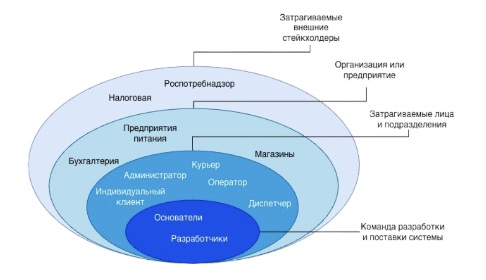
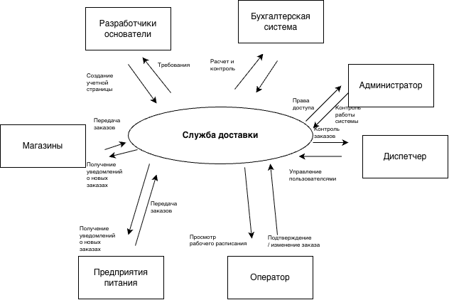

# Кейс «Быстрая доставка»

Кейс по бизнес- и системному анализу онлайн-системы быстрой доставки небольших заказов индивидуальным клиентам.

Для идентификации артефактов проекта используется префикс `FDE` — Fast Delivery.

## Артефакты проекта

| Код        | Артефакт                                                                                                              | Назначение                                                                                                                                                             |
| ------------- | ----------------------------------------------------------------------------------------------------------------------------- | -------------------------------------------------------------------------------------------------------------------------------------------------------------------------------- |
| `FDE_INF`   | [Каталог источников информации](src/FDE_INF.xlsx)                                                   | Систематизация источников для изучения предметной области и требований                                            |
| `FDE_GLS`   | [Глоссарий](src/FDE_GLS.xlsx)                                                                                         | Формирование единого понимания терминов и понятий предметной области                                                |
| `FDE_DEC`   | [Декомпозиция](src/FDE_DEC.docx)                                                                                   | Структурирование действий курьеров и ролей участников процесса доставки                                          |
| `FDE_STA`   | [Каталог заинтересованных сторон](src/FDE_STA.xlsx)                                               | Выявление и классификация заинтересованных сторон проекта                                                                    |
| `FDE_ONION` | [Луковичная диаграмма](src/FDE_onion.png) · [исходник](src/FDE_onion.drawio)                        | Визуализация заинтересованных сторон по степени их взаимодействия с системой                                 |
| `FDE_NDS`   | [Интересы, потребности и проблемы заинтересованных сторон](src/FDE_NDS.xlsx) | Анализ интересов, потребностей и проблем заинтересованных сторон                                                        |
| `FDE_ASIS` | [Модель текущего состояния](src/FDE_ASIS.xlsx) | Описание ролей, их действий и проблем до внедрения системы |
| `FDE_CON`   | [Контекстная диаграмма](src/FDE_CON.png) · [исходник](src/FDE_CON.drawio)                          | Определение границ системы и её взаимодействия с внешними сущностями                                                 |
| `FDE_TOBE`  | [Модель целевого состояния](src/FDE_TOBE.xlsx)                                                          | Описание изменений процессов после внедрения системы и способов разрешения выявленных проблем |
| `FDE_STR`   | [Входные и выходные потоки данных](src/FDE_STR.xlsx)                                               | Проверка информационного обмена между системой и внешними сущностям                                                  |

## Система именования

Для проектных артефактов используется формат:

`<PROJECT>_<ARTIFACT>`

где:

- `FDE` — Fast Delivery, префикс проекта;
- `INF` — Information Sources, каталог источников информации;
- `GLS` — Glossary, глоссарий проекта;
- `DEC` — Decomposition, декомпозиция процессов и объектов предметной области;
- `STA` — Stakeholders, каталог заинтересованных сторон;
- `ONION` — Onion Diagram, луковичная диаграмма заинтересованных сторон;
- `NDS` — Needs, интересы, потребности и проблемы заинтересованных сторон;
- `ASIS` — As Is, модель текущего состояния;
- `CON` — Context Diagram, контекстная диаграмма;
- `TOBE` — To Be, модель целевого состояния;
- `STR` — Streams, входные и выходные потоки данных.

Элементы каталогов имеют собственные уникальные идентификаторы.

## `FDE_INF` — каталог источников информации

[`FDE_INF.xlsx`](src/FDE_INF.xlsx) содержит источники, используемые для изучения предметной области быстрой доставки и уточнения представления о будущей системе.

Для каждого источника фиксируются:

- уникальный идентификатор;
- наименование и ссылка;
- тип источника;
- приоритет изучения;
- актуальность;
- статус изучения;
- дата добавления;
- автор;
- примечания.

Каталог позволяет систематизировать исходную информацию и определять приоритет её изучения.

## `FDE_GLS` — глоссарий проекта

[`FDE_GLS.xlsx`](src/FDE_GLS.xlsx) содержит основные термины и понятия предметной области службы доставки.

Для каждого понятия фиксируются:

- уникальный идентификатор;
- термин;
- определение;
- синонимы;
- источник определения;
- автор;
- дата добавления или актуализации;
- примечания.

Глоссарий используется для единообразного понимания терминов и актуализируется по мере развития проекта.

## `FDE_DEC` — декомпозиция

[`FDE_DEC.docx`](src/FDE_DEC.docx) содержит результаты декомпозиции предметной области службы доставки.

В рамках анализа выполнены:

- декомпозиция действий курьера;
- определение цели и вида декомпозиции действий;
- определение уровней декомпозиции;
- объектная декомпозиция действующих лиц и ролей;
- определение цели объектной декомпозиции;
- определение её уровней.

Декомпозиция позволяет структурировать действия участников процесса доставки и выделить основные роли, которые необходимо учитывать при дальнейшем анализе и проектировании системы.

## `FDE_STA` — каталог заинтересованных сторон

[`FDE_STA.xlsx`](src/FDE_STA.xlsx) содержит каталог заинтересованных сторон проекта службы доставки.

Для каждой заинтересованной стороны фиксируются характеристики, необходимые для дальнейшего анализа, в том числе:

- уникальный идентификатор;
- наименование заинтересованной стороны;
- принадлежность к организации или физическим лицам;
- категория заинтересованной стороны;
- уровень взаимодействия с системой;
- роль в проекте;
- дата добавления.

Каталог позволяет систематизировать участников и внешние стороны, способные влиять на систему, использовать её или быть затронутыми её работой.

## `FDE_ONION` — луковичная диаграмма

Луковичная диаграмма отражает заинтересованные стороны проекта и их положение относительно системы быстрой доставки.

На диаграмме заинтересованные стороны распределены по слоям в зависимости от характера и степени их взаимодействия с системой.

Также в модель включены заинтересованные стороны, которые не указаны напрямую в исходном описании кейса, но могут участвовать в реальном проекте.

  

Файлы диаграммы:

- [PNG — просмотр диаграммы](src/FDE_onion.png)
- [Draw.io — редактируемый исходник](src/FDE_onion.drawio)

Диаграмма используется совместно с каталогом `FDE_STA` и помогает определить окружение системы, категории заинтересованных сторон и их отношение к проекту.

## `FDE_NDS` — интересы, потребности и проблемы заинтересованных сторон

[`FDE_NDS.xlsx`](src/FDE_NDS.xlsx) содержит результаты анализа заинтересованных сторон проекта с точки зрения их интересов, потребностей и существующих проблем.

Для каждой заинтересованной стороны фиксируются:

- уникальный идентификатор;
- наименование заинтересованной стороны;
- интересы по отношению к проекту и будущей системе;
- потребности, которые необходимо учитывать при дальнейшем анализе;
- проблемы текущего состояния.

Артефакт позволяет перейти от определения заинтересованных сторон к пониманию того, какую ценность должна предоставлять система и какие проблемы необходимо учитывать при дальнейшем формировании требований.

## `FDE_ASIS` — модель текущего состояния

[`FDE_ASIS.xlsx`](src/FDE_ASIS.xlsx) содержит описание текущего состояния процессов службы доставки до внедрения проектируемой информационной системы.

В модели зафиксированы:

- роли заинтересованных сторон;
- выполняемые ими действия;
- существующие способы выполнения действий;
- проблемы, возникающие в текущих процессах.

Модель `As Is` позволяет зафиксировать исходное состояние предметной области и определить проблемные участки, которые необходимо учитывать при проектировании будущей системы.

## `FDE_CON` — контекстная диаграмма

Контекстная диаграмма отражает границы проектируемой системы быстрой доставки и её взаимодействие с внешним окружением.

На диаграмме представлены:

- проектируемая информационная система;
- роли пользователей, непосредственно взаимодействующие с системой;
- внешние информационные системы;
- входящие и исходящие информационные потоки.

Диаграмма позволяет определить, какие участники и системы находятся за границами проектируемого решения и какой информацией они обмениваются с системой.

  

Файлы диаграммы:

- [PNG — просмотр диаграммы](src/FDE_CON.png)
- [Draw.io — редактируемый исходник](src/FDE_CON.drawio)

## `FDE_TOBE` — модель целевого состояния

[`FDE_TOBE.xlsx`](src/FDE_TOBE.xlsx) содержит описание предполагаемого состояния процессов после внедрения информационной системы службы доставки.

Для действий заинтересованных сторон отражены:

- текущее состояние `As Is`;
- предполагаемое состояние `To Be`;
- изменения в способах выполнения действий;
- влияние внедрения системы на существующие проблемы;
- предполагаемые способы их разрешения.

Сопоставление моделей `As Is` и `To Be` позволяет определить, какие изменения должна обеспечить проектируемая система и каким образом они связаны с выявленными ранее проблемами заинтересованных сторон.

## `FDE_STR` — входные и выходные потоки данных

[`FDE_STR.xlsx`](src/FDE_STR.xlsx) содержит описание информационного обмена между системой быстрой доставки и внешними сущностями.

В таблице фиксируются:

- внешняя сущность;
- направление информационного потока;
- передаваемые данные;
- соответствие потоков контекстной диаграмме;
- примечания и выявленные расхождения при их наличии.

Артефакт используется для проверки полноты и согласованности информационных потоков, представленных на контекстной диаграмме.
